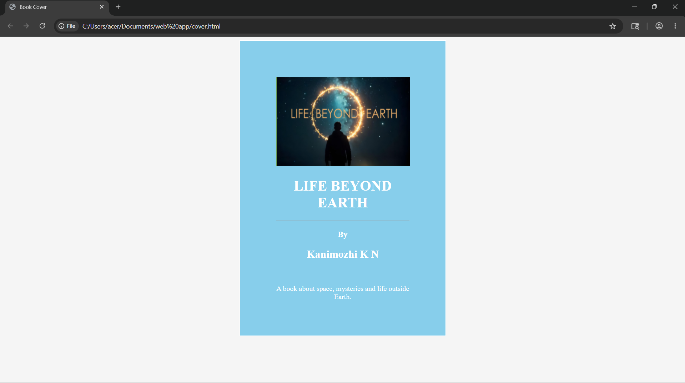

# Ex.05 Book Front Cover Page Design
## Date:22-05-2026

## AIM:
To design a book front cover page using HTML and CSS.

## DESIGN STEPS:

### Step 1:
Create a Django Admin project.

### Step 2:
Create an app in the Django interface.

### Step 3:
Create a folder named 'static' in the app folder.

### Step 4:
Create a new HTML file in the static folder.

### Step 5:
Write the HTML code with relevant CSS properties.

### Step 6:
Choose the appropriate style and color scheme.

### Step 7:
Insert the images in their appropriate places.

### Step 8:
Publish the website in the LocalHost.

## PROGRAM:

```
<!DOCTYPE html>
<html>
    <head>
        <title>Book Cover</title>

        <style>

            body{
                text-align:center;
                background-color: whitesmoke;
            }

            .cover{
                width:300px;
                height:500px;
                background-color: skyblue;
                color:white;
                margin:auto;
                border:2px solid white;
                padding:80px;
            }

            img{
                width:300px;
                height:200px;
                }

        </style>

    </head>

    <body>

        <div class="cover">

        

        <h1>LIFE BEYOND EARTH</h1>

        <hr>

        <h3>By</h3>

        <h2>Kanimozhi K N</h2><br>

        <p>
            A book about space,
            mysteries and life
            outside Earth.
        </p>

        </div>

    </body>
</html>

```

## OUTPUT:



## RESULT:
The program for designing book front cover page using HTML and CSS is completed successfully.
